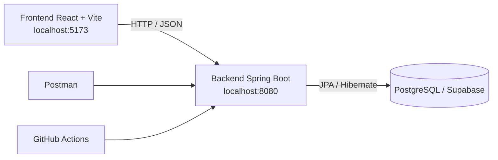

# Laboratorio 1 · Sistema Bancario de Transferencias

[](https://github.com/spalacioc05/lab12026p/actions/workflows/build.yml)

<div align="center">


</div>

## Descripción

Este proyecto implementa un sistema bancario básico para el curso Arquitectura de Software. El sistema permite registrar clientes, consultar cuentas, ejecutar transferencias y revisar el historial de movimientos. La solución está separada en dos módulos:

- `backend`: API REST construida con Spring Boot.
- `frontend`: aplicación web construida con React y Vite.

Además de la implementación funcional del laboratorio 1, el proyecto ya incorpora parte del enfoque del laboratorio 2: pruebas automáticas con JUnit 5, validación de cobertura con JaCoCo y pipeline de integración continua con GitHub Actions.

## Información académica

| Elemento | Detalle |
| --- | --- |
| Curso | Arquitectura de Software |
| Institución | Universidad de Antioquia |
| Profesor | Diego José Luis Botia Valderrama |
| Integrantes | Santiago Palacio Cárdenas, Sarai Restrepo Rodríguez, Juan Pablo Herrera Jaramillo, Jimena Muñoz Gómez |

## Arquitectura general



## Stack tecnológico

| Capa | Tecnologías |
| --- | --- |
| Backend | Java 17, Spring Boot, Spring Web, Spring Data JPA, Jakarta Validation, MapStruct, Maven Wrapper |
| Base de datos | PostgreSQL en Supabase |
| Frontend | React 19, Vite, Axios, React Router |
| Pruebas | JUnit 5, Mockito, MockMvc |
| Cobertura | JaCoCo |
| CI | GitHub Actions |

## Estructura del proyecto

```text
lab12026p/
├── .github/
│   └── workflows/
│       └── build.yml
├── ArquiSoft.postman_collection.json
├── README.md
├── backend/
│   ├── mvnw
│   ├── mvnw.cmd
│   ├── pom.xml
│   └── src/
│       ├── main/java/com/udea/lab12026p/
│       │   ├── config/
│       │   ├── controller/
│       │   ├── dto/
│       │   ├── entity/
│       │   ├── exception/
│       │   ├── mapper/
│       │   ├── repository/
│       │   └── service/
│       └── test/java/com/udea/lab12026p/
│           ├── controller/
│           └── service/
└── frontend/
    ├── package.json
    └── src/
```

## Backend

El backend sigue una arquitectura por capas.

- `controller`: expone los endpoints REST.
- `service`: implementa la lógica de negocio.
- `repository`: acceso a datos con Spring Data JPA.
- `entity`: modelo persistente.
- `dto`: objetos de transferencia.
- `mapper`: conversión entidad ↔ DTO.
- `exception`: manejo centralizado de errores.

### Funcionalidades bancarias

- Crear clientes con número de cuenta y saldo inicial.
- Consultar clientes por id o por número de cuenta.
- Transferir dinero entre cuentas.
- Validar que las cuentas existan.
- Validar que origen y destino sean diferentes.
- Validar saldo suficiente antes de transferir.
- Consultar historial de transacciones por cuenta.

### Endpoints principales

| Método | Endpoint | Descripción |
| --- | --- | --- |
| GET | `/api/customers` | Lista todos los clientes |
| GET | `/api/customers/{id}` | Consulta un cliente por id |
| GET | `/api/customers/account/{accountNumber}` | Consulta un cliente por número de cuenta |
| POST | `/api/customers` | Registra un nuevo cliente |
| POST | `/api/transactions/transfer` | Ejecuta una transferencia |
| GET | `/api/transactions/account/{accountNumber}` | Lista transacciones de una cuenta |

### Endpoints auxiliares con Faker

Se agregó un `DataController` para pruebas, demostraciones y apoyo al laboratorio 2.

| Método | Endpoint | Descripción |
| --- | --- | --- |
| GET | `/api/faker/health` | Health check del backend |
| GET | `/api/faker/version` | Versión actual de la API |
| GET | `/api/faker/customers` | Genera 10 clientes ficticios |
| GET | `/api/faker/transactions` | Genera 10 transacciones ficticias |
| GET | `/api/faker/cards` | Genera 10 tarjetas ficticias |
| GET | `/api/faker/currencies` | Genera 10 monedas ficticias |

## Base de datos

La aplicación ya no está configurada para MySQL local. Actualmente usa PostgreSQL en Supabase mediante pooler.

Configuración actual:

- Motor: PostgreSQL
- Proveedor: Supabase
- Conexión: pooler IPv4
- Persistencia: Hibernate con `spring.jpa.hibernate.ddl-auto=update`

Tablas principales:

| Tabla | Propósito |
| --- | --- |
| `customers` | Guarda clientes y saldo actual |
| `transactions` | Guarda transferencias entre cuentas |

## Ejecución local

### Prerrequisitos

- JDK 17
- Node.js y npm
- Acceso a la base de datos configurada en Supabase

### Backend

```powershell
cd backend
.\mvnw.cmd spring-boot:run
```

Disponible en:

```text
http://localhost:8080
```

### Frontend

```powershell
cd frontend
npm install
npm run dev
```

Disponible en:

```text
http://localhost:5173
```

## Pruebas automáticas

El proyecto ya incluye pruebas automatizadas alineadas con el enfoque del laboratorio 2.

### Qué se prueba

- Lógica de negocio en servicios con JUnit 5 y Mockito.
- Validaciones y respuestas HTTP en controladores con MockMvc.
- Endpoints del `DataController`.
- Reglas de error como cuenta inexistente, saldo insuficiente o payload inválido.

### Ejecutar pruebas

```powershell
cd backend
.\mvnw.cmd test
```

### Ejecutar pruebas con coverage

```powershell
cd backend
.\mvnw.cmd verify
```

## Cobertura con JaCoCo

JaCoCo ya está integrado en [backend/pom.xml](backend/pom.xml) y ejecuta lo siguiente:

- instrumentación de pruebas
- generación de reporte de coverage
- validación de umbral mínimo de cobertura

Estado actual medido sobre las clases relevantes incluidas en la regla:

- cobertura de líneas: 93.2%
- umbral mínimo configurado: 80%

Reporte local generado en:

- [backend/target/site/jacoco/index.html](backend/target/site/jacoco/index.html)

## Integración continua

El proyecto ya tiene workflow de GitHub Actions en [\.github/workflows/build.yml](.github/workflows/build.yml).

Este workflow hace lo siguiente:

- checkout del repositorio
- configuración de Java 17
- caché de dependencias Maven
- ejecución de `mvn verify`
- publicación de artefactos de JaCoCo y Surefire

## Postman

El repositorio incluye la colección [ArquiSoft.postman_collection.json](ArquiSoft.postman_collection.json), útil para probar manualmente los endpoints bancarios y los auxiliares con Faker.

## Estado frente a laboratorio 2

Ya quedó implementado en este proyecto:

- pruebas unitarias con JUnit 5
- mocking con Mockito
- pruebas web con MockMvc
- coverage con JaCoCo
- workflow de GitHub Actions

Pendiente para completar más del laboratorio 2:

- integración con SonarCloud
- integración con Snyk
- publicación más formal de métricas de calidad en el pipeline

## Recomendaciones

- No dejar credenciales reales de base de datos en texto plano si el repositorio será público.
- Mover credenciales a secrets o variables de entorno cuando se complete la integración CI/CD.
- Mantener `mvn verify` como comando base de validación antes de hacer push.
- DBeaver puede ser útil para inspeccionar tablas, saldos y registros de transacciones durante las pruebas.
