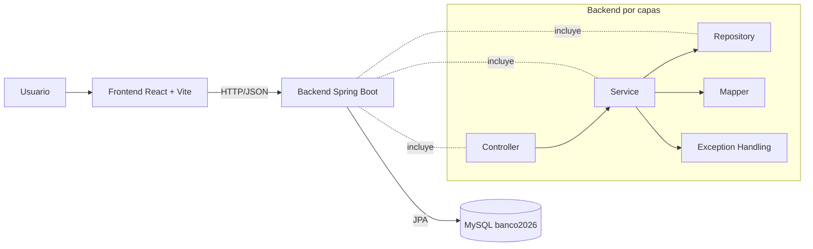

# Laboratorio 1 - Arquitectura de Software 2026

[](https://www.oracle.com/java/)
[](https://spring.io/projects/spring-boot)
[](https://maven.apache.org/)
[](https://www.mysql.com/)
[](https://react.dev/)
[](https://vite.dev/)
[](https://tailwindcss.com/)

Aplicacion bancaria basica desarrollada como laboratorio academico, con arquitectura por capas en backend, persistencia en MySQL y una interfaz frontend moderna para operaciones clave.

---

## 1. Objetivo del laboratorio

Construir un sistema bancario basico que permita:

1. Consultar clientes.
2. Realizar transferencias de dinero entre cuentas.
3. Consultar el historico de transacciones por cuenta.

El laboratorio busca reforzar buenas practicas de arquitectura, separacion de responsabilidades, validaciones de negocio e integracion frontend-backend.

---

## 2. Descripcion general del sistema

El sistema esta compuesto por tres bloques principales:

- `frontend`: Interfaz de usuario en React + Vite.
- `backend`: API REST en Spring Boot.
- `database`: Base de datos MySQL (`banco2026`).

Flujo general:

1. El usuario interactua con la interfaz web.
2. El frontend consume endpoints REST del backend mediante Axios.
3. El backend ejecuta reglas de negocio, valida datos y persiste informacion en MySQL.
4. La respuesta retorna al frontend para actualizar la vista y notificar al usuario.

---

## 3. Arquitectura del proyecto

### 3.1 Backend por capas

El backend sigue una arquitectura en capas:

- `controller`: expone endpoints REST.
- `service`: contiene logica de negocio y validaciones.
- `repository`: acceso a datos con Spring Data JPA.
- `entity`: mapeo de tablas de base de datos.
- `dto`: contratos de entrada/salida para no exponer entidades directamente.
- `mapper`: conversion entre entidades y DTOs.
- `exception`: manejo centralizado de errores.
- `config`: configuraciones transversales (ej. CORS).

### 3.2 Rol del frontend

El frontend se encarga de:

- Navegacion y experiencia de usuario.
- Formularios y validaciones visuales.
- Consumo de servicios HTTP.
- Visualizacion de tablas, cards, estados de carga/error y notificaciones.

### 3.3 Rol de MySQL

MySQL almacena clientes y transacciones, garantizando persistencia de saldos y trazabilidad de operaciones.

### 3.4 Diagrama de arquitectura



---

## 4. Stack tecnologico

### 4.1 Niveles del stack tecnologico

| Nivel | Tecnologias |
|---|---|
| Presentacion | React, Vite, Tailwind CSS, React Router DOM, lucide-react, react-hot-toast |
| Integracion | Axios |
| Aplicacion | Java 17, Spring Boot, Spring Web, Validation |
| Persistencia | Spring Data JPA |
| Base de datos | MySQL |
| Build y tooling | Maven, npm |

### 4.2 Tecnologias y proposito

| Tecnologia | Uso en el proyecto |
|---|---|
| Java 17 | Lenguaje principal del backend |
| Spring Boot | Framework para API REST y configuracion productiva |
| Spring Web | Creacion de controladores HTTP |
| Spring Data JPA | Acceso a datos y repositorios |
| Validation | Validacion de DTOs y reglas de entrada |
| MySQL | Persistencia de clientes y transacciones |
| React | Construccion de interfaz SPA |
| Vite | Entorno de desarrollo y build rapido |
| Axios | Cliente HTTP para consumir la API |
| React Router DOM | Ruteo y navegacion del frontend |
| Tailwind CSS | Estilos utilitarios y diseno moderno |
| lucide-react | Iconografia consistente |
| react-hot-toast | Feedback visual (exitos y errores) |

---

## 5. Estructura del proyecto

```text
lab12026p/
├─ backend/
│  ├─ src/main/java/com/udea/lab12026p/
│  │  ├─ controller/
│  │  ├─ service/
│  │  ├─ repository/
│  │  ├─ entity/
│  │  ├─ dto/
│  │  ├─ mapper/
│  │  ├─ exception/
│  │  └─ config/
│  └─ src/main/resources/application.properties
├─ frontend/
│  ├─ src/components/
│  ├─ src/pages/
│  ├─ src/services/
│  ├─ src/layouts/
│  ├─ src/router/
│  ├─ src/hooks/
│  ├─ src/lib/
│  └─ src/utils/
└─ README.md
```

Resumen:

- `backend/`: logica del dominio, API REST, validaciones y persistencia.
- `frontend/`: interfaz visual, navegacion y consumo de API.

---

## 6. Requisitos previos

- Java 17
- Maven (o Maven Wrapper incluido en `backend`)
- Node.js y npm
- MySQL (puerto `3306`)
- Opcional: DBeaver o MySQL Workbench
- Opcional: Postman

Verificacion rapida:

```bash
java -version
mvn -version
node -v
npm -v
```

---

## 7. Configuracion de base de datos

Credenciales configuradas:

- Host: `localhost`
- Puerto: `3306`
- Usuario: `root`
- Contrasena: `spalacioc`
- Base de datos: `banco2026`

Script SQL sugerido:

```sql
CREATE DATABASE IF NOT EXISTS banco2026;
USE banco2026;

CREATE TABLE customers (
		id BIGINT AUTO_INCREMENT PRIMARY KEY,
		account_number VARCHAR(50) NOT NULL UNIQUE,
		first_name VARCHAR(100) NOT NULL,
		last_name VARCHAR(100) NOT NULL,
		balance DECIMAL(15,2) NOT NULL DEFAULT 0.00
);

CREATE TABLE transactions (
		id BIGINT AUTO_INCREMENT PRIMARY KEY,
		sender_account_number VARCHAR(50) NOT NULL,
		receiver_account_number VARCHAR(50) NOT NULL,
		amount DECIMAL(15,2) NOT NULL,
		timestamp DATETIME NOT NULL
);

INSERT INTO customers (account_number, first_name, last_name, balance) VALUES
('ACC1001', 'Brayan', 'Gomez', 1500000.00),
('ACC1002', 'Ximena', 'Lopez', 980000.00),
('ACC1003', 'Juan', 'Perez', 500000.00);
```

Nota:

- El backend tiene `spring.jpa.hibernate.ddl-auto=update`, por lo que puede ajustar esquema automaticamente.

---

## 8. Configuracion y ejecucion del backend

Ubicarse en la carpeta backend:

```bash
cd backend
```

Comandos principales:

| Comando | Descripcion |
|---|---|
| `./mvnw test` o `./mvnw.cmd test` | Ejecuta pruebas del backend |
| `./mvnw spring-boot:run` o `./mvnw.cmd spring-boot:run` | Inicia la API REST |

URL backend:

- `http://localhost:8080`

Configuraciones relevantes:

- Base de datos en `backend/src/main/resources/application.properties`.
- CORS habilitado para frontend en `backend/src/main/java/com/udea/lab12026p/config/CorsConfig.java`.

---

## 9. Configuracion y ejecucion del frontend

Ubicarse en la carpeta frontend:

```bash
cd frontend
```

Instalacion de dependencias:

```bash
npm install
```

Ejecucion en desarrollo:

```bash
npm run dev
```

Compilacion de produccion:

```bash
npm run build
```

URL frontend:

- `http://localhost:5173`

Configuracion de API base:

- Variable opcional: `VITE_API_BASE_URL`
- Archivo de ejemplo: `frontend/.env.example`

---

## 10. Endpoints del backend

Base URL: `http://localhost:8080`

| Metodo | Endpoint | Descripcion |
|---|---|---|
| GET | `/api/customers` | Lista todos los clientes |
| GET | `/api/customers/{id}` | Consulta cliente por id |
| GET | `/api/customers/account/{accountNumber}` | Consulta cliente por numero de cuenta |
| POST | `/api/customers` | Crea un nuevo cliente |
| POST | `/api/transactions/transfer` | Realiza una transferencia |
| GET | `/api/transactions/account/{accountNumber}` | Obtiene historico de transacciones de una cuenta |

### 10.1 Body ejemplo - Crear cliente

```json
{
	"firstName": "Laura",
	"lastName": "Ramirez",
	"accountNumber": "ACC2001",
	"balance": 750000.00
}
```

### 10.2 Body ejemplo - Transferencia

```json
{
	"senderAccountNumber": "ACC1001",
	"receiverAccountNumber": "ACC1002",
	"amount": 100000.00
}
```

---

## 11. Vistas del frontend

### 11.1 Vista de clientes

- Lista todos los clientes en tabla.
- Muestra: ID, nombre completo, numero de cuenta y saldo.
- Incluye busqueda por numero de cuenta.
- Incluye creacion de cliente.

### 11.2 Vista de transferencia

- Formulario para transferir entre cuentas.
- Campos: `senderAccountNumber`, `receiverAccountNumber`, `amount`.
- Validaciones visuales y feedback con toast.

### 11.3 Vista de historico de transacciones

- Consulta por numero de cuenta.
- Muestra tabla de transacciones con ID, origen, destino, monto, fecha/hora.
- Mensaje claro cuando no hay movimientos.

---

## 12. Flujo de uso del sistema

1. Levantar MySQL y asegurar que exista `banco2026`.
2. Iniciar backend (`backend`, puerto `8080`).
3. Iniciar frontend (`frontend`, puerto `5173`).
4. Abrir la vista de clientes para verificar datos iniciales.
5. Realizar una transferencia desde la vista de transferencias.
6. Consultar historico por cuenta y validar que aparezca la nueva transaccion.

---

## 13. Pruebas recomendadas

| Prueba | Accion | Resultado esperado |
|---|---|---|
| Listado de clientes | `GET /api/customers` o vista clientes | Tabla con clientes existentes |
| Consulta por cuenta | Buscar `ACC1001` | Retorna solo ese cliente |
| Transferencia valida | ACC1001 -> ACC1002 por monto permitido | Exito y registro de transaccion |
| Saldo insuficiente | Transferir mas del saldo disponible | Error de negocio (400) |
| Cuenta inexistente | Usar cuenta no registrada | Error de recurso (404) |
| Historico de transacciones | Consultar por cuenta con movimientos | Lista de transacciones ordenadas |

---

## 14. Validaciones implementadas

- No permite transferencias con saldo insuficiente.
- No permite cuentas inexistentes.
- No permite montos negativos o cero.
- No permite transferir a la misma cuenta.
- Valida campos obligatorios en requests.

---

## 15. Errores comunes y solucion

| Problema | Causa probable | Solucion recomendada |
|---|---|---|
| Error de conexion a MySQL | Servicio apagado o credenciales incorrectas | Verificar MySQL activo, usuario `root`, clave `spalacioc`, DB `banco2026` |
| Puerto 8080 ocupado | Otro servicio en uso | Cambiar `server.port` o detener proceso ocupando el puerto |
| Puerto 5173 ocupado | Otro proyecto Vite activo | Detener proceso o ejecutar con puerto alterno |
| Error CORS | Backend sin politica CORS correcta | Verificar `CorsConfig` para `http://localhost:5173` |
| Dependencias faltantes frontend | `node_modules` incompleto | Ejecutar `npm install` en `frontend` |
| Backend no inicia | Falla de build/configuracion | Ejecutar `./mvnw test` y revisar logs |
| Frontend sin conexion a API | Base URL incorrecta | Validar `VITE_API_BASE_URL` o fallback a `http://localhost:8080` |

---

## 16. Recomendaciones para ejecutar sin errores

- Iniciar primero MySQL, luego backend y finalmente frontend.
- Confirmar puertos esperados: backend `8080`, frontend `5173`.
- Evitar modificar rutas de API ya que el frontend consume rutas exactas.
- Si cambias la URL del backend, actualizar `VITE_API_BASE_URL`.
- Probar endpoints con Postman antes de depurar el frontend.

---

## 17. Mejoras opcionales futuras

- Actualizar clientes (PUT).
- Eliminar clientes (DELETE).
- Dashboard con metricas avanzadas y graficas.
- Autenticacion/autorizacion (JWT).
- Paginacion y filtros avanzados.
- Pruebas E2E y cobertura automatizada.

---

## 18. Conclusion

Este laboratorio logra una implementacion completa de una aplicacion bancaria basica con separacion clara entre frontend, backend y base de datos. La solucion aplica arquitectura por capas, validaciones de negocio, integracion REST y una experiencia de usuario moderna, cumpliendo los objetivos academicos de Arquitectura de Software.

---

## 19. Autores / creditos

Espacio reservado para completar:

- Nombre 1
- Nombre 2
- Nombre 3

---

## Anexo A - Comandos rapidos

### Levantar backend (Windows)

```powershell
cd backend
.\mvnw.cmd test
.\mvnw.cmd spring-boot:run
```

### Levantar frontend

```bash
cd frontend
npm install
npm run dev
```

### Ejecucion simultanea recomendada

1. Terminal A: backend.
2. Terminal B: frontend.
3. Abrir `http://localhost:5173`.
