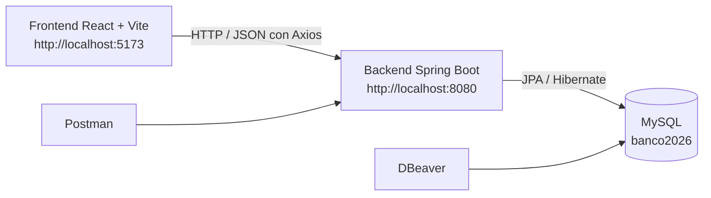

# Laboratorio 1 · Sistema Bancario de Transferencias

<div align="center">


</div>

## Descripción

Este laboratorio del curso **Arquitectura de Software** implementa un sistema bancario básico para la gestión de clientes, consulta de cuentas y transferencias entre cuentas. El proyecto está dividido en un **backend REST** construido con Spring Boot y un **frontend web** desarrollado con React + Vite, conectados a una base de datos MySQL llamada **banco2026**.

El sistema permite registrar clientes, consultar información por número de cuenta, ejecutar transferencias con validaciones de negocio y revisar el histórico de movimientos por cuenta.

## Información académica

| Elemento | Detalle |
| --- | --- |
| Curso | Arquitectura de Software |
| Institución | Universidad de Antioquia |
| Facultad | Facultad de Ingeniería |
| Profesor | Diego José Luis Botia Valderrama |
| Integrantes | Santiago Palacio Cárdenas, Sarai Restrepo Rodríguez, Juan Pablo Herrera Jaramillo, Jimena Muñoz Gómez |

## Resumen general del sistema

### Backend

- API REST en Spring Boot con arquitectura por capas: `controller`, `service`, `repository`, `mapper`, `dto`, `entity` y `exception`.
- Persistencia con Spring Data JPA sobre MySQL.
- Validaciones con Jakarta Validation para creación de clientes y transferencias.
- Reglas de negocio para impedir transferencias a la misma cuenta, validar existencia de cuentas y verificar saldo suficiente.
- Mapeo entre entidades y DTOs mediante MapStruct.

### Frontend

El frontend se encarga de:

- Navegacion y experiencia de usuario.
- Formularios y validaciones visuales.
- Consumo de servicios HTTP.
- Visualizacion de tablas, cards, estados de carga/error y notificaciones.

### 3.3 Rol de MySQL

MySQL almacena clientes y transacciones, garantizando persistencia de saldos y trazabilidad de operaciones.

### 3.4 Diagrama de arquitectura (Mermaid)



### Cómo se conectan las capas

- El frontend consume la API REST del backend usando Axios.
- El backend expone endpoints bajo el prefijo `/api` y habilita CORS para `http://localhost:5173`.
- Spring Boot se conecta a la base de datos `banco2026` usando MySQL y genera/actualiza las tablas con `spring.jpa.hibernate.ddl-auto=update`.
- Las transferencias registradas desde la interfaz web o Postman actualizan saldos en `customers` y crean registros en `transactions`.

## Stack tecnológico

| Capa | Tecnologías |
| --- | --- |
| Backend | Java 17, Spring Boot, Spring Web, Spring Data JPA, Spring Validation, MapStruct, Maven Wrapper |
| Base de datos | MySQL |
| Frontend | React 19, Vite, React Router, Axios, Tailwind CSS, Framer Motion, Lucide React, React Hot Toast |
| Pruebas e inspección | Postman, DBeaver |

## Estructura general del proyecto

```text
lab12026p/
├── ArquiSoft.postman_collection.json
├── README.md
├── backend/
│   ├── pom.xml
│   └── src/main/java/com/udea/lab12026p/
│       ├── config/
│       ├── controller/
│       ├── dto/
│       ├── entity/
│       ├── exception/
│       ├── mapper/
│       ├── repository/
│       └── service/
└── frontend/
		├── package.json
		├── .env.example
		└── src/
				├── components/
				├── hooks/
				├── layouts/
				├── lib/
				├── pages/
				├── router/
				├── services/
				└── utils/
```

## Base de datos `banco2026`

La aplicación está configurada para conectarse a una base de datos MySQL local llamada `banco2026` en el puerto `3306`. El modelo persistente actual se compone de dos tablas principales.

| Tabla | Propósito | Campos importantes |
| --- | --- | --- |
| `customers` | Almacena la información de cada cliente y su saldo actual | `id`, `account_number`, `first_name`, `last_name`, `balance` |
| `transactions` | Registra las transferencias realizadas entre cuentas | `id`, `sender_account_number`, `receiver_account_number`, `amount`, `timestamp` |

### Observaciones del modelo

- `account_number` es único en la tabla `customers`.
- `balance` y `amount` se almacenan con dos decimales.
- `timestamp` se genera automáticamente al persistir una transacción.
- Las transacciones almacenan directamente los números de cuenta de origen y destino.

### Datos de ejemplo recomendados

Primero cree la base de datos:

```sql
CREATE DATABASE banco2026 CHARACTER SET utf8mb4 COLLATE utf8mb4_unicode_ci;
```

Luego puede insertar clientes de prueba como los siguientes:

```sql
INSERT INTO customers (account_number, first_name, last_name, balance) VALUES
('ACC1001', 'Carlos', 'Gómez', 1500000.00),
('ACC1002', 'María', 'Pérez', 950000.00),
('ACC1004', 'Laura', 'Martínez', 800000.00);
```

También es válido crear estos registros desde el endpoint `POST /api/customers` usando Postman o el frontend.

## Ejecución del proyecto

### Backend

Prerrequisitos:

- JDK 17
- MySQL en ejecución
- Base de datos `banco2026` creada

Pasos:

```powershell
cd backend
.\mvnw.cmd spring-boot:run
```

La API quedará disponible en:

```text
http://localhost:8080
```

Nota:

- La configuración actual del datasource está en `backend/src/main/resources/application.properties`.
- Si sus credenciales de MySQL son diferentes, ajústelas antes de iniciar el backend.

### Frontend

Prerrequisitos:

- Node.js
- npm

Pasos:

```powershell
cd frontend
Copy-Item .env.example .env
npm install
npm run dev
```

La aplicación web quedará disponible en:

```text
http://localhost:5173
```

Nota:

- El archivo `.env.example` ya apunta a `http://localhost:8080`.
- Incluso sin archivo `.env`, el cliente usa `http://localhost:8080` como valor por defecto.

## Endpoints principales

| Método | Endpoint | Descripción |
| --- | --- | --- |
| GET | `/api/customers` | Lista todos los clientes |
| GET | `/api/customers/{id}` | Consulta un cliente por id |
| GET | `/api/customers/account/{accountNumber}` | Consulta un cliente por número de cuenta |
| POST | `/api/customers` | Registra un nuevo cliente |
| POST | `/api/transactions/transfer` | Ejecuta una transferencia entre cuentas |
| GET | `/api/transactions/account/{accountNumber}` | Consulta el histórico de transacciones de una cuenta |

## Ejemplos listos para probar en Postman

El repositorio incluye la colección [ArquiSoft.postman_collection.json](./ArquiSoft.postman_collection.json), que puede importarse directamente en Postman.

### 1. Crear cliente

```http
POST http://localhost:8080/api/customers
Content-Type: application/json
```

```json
{
	"firstName": "Laura",
	"lastName": "Martinez",
	"accountNumber": "ACC1004",
	"balance": 800000.00
}
```

### 2. Listar clientes

```http
GET http://localhost:8080/api/customers
```

### 3. Buscar cliente por id

```http
GET http://localhost:8080/api/customers/1
```

### 4. Buscar cliente por número de cuenta

```http
GET http://localhost:8080/api/customers/account/ACC1001
```

### 5. Hacer transferencia

```http
POST http://localhost:8080/api/transactions/transfer
Content-Type: application/json
```

```json
{
	"senderAccountNumber": "ACC1001",
	"receiverAccountNumber": "ACC1002",
	"amount": 250000.00
}
```

---

## 11. Vistas del frontend

### 11.1 Vista de clientes

- Lista todos los clientes en tabla.
- Muestra: ID, nombre completo, numero de cuenta y saldo.
- Incluye busqueda por numero de cuenta.
- Incluye creacion de cliente.

### 11.2 Vista de transferencia

- Formulario para transferir entre cuentas.
- Campos: `senderAccountNumber`, `receiverAccountNumber`, `amount`.
- Validaciones visuales y feedback con toast.

### 11.3 Vista de historico de transacciones

- Consulta por numero de cuenta.
- Muestra tabla de transacciones con ID, origen, destino, monto, fecha/hora.
- Mensaje claro cuando no hay movimientos.

---

## 12. Flujo de uso del sistema

1. Levantar MySQL y asegurar que exista `banco2026`.
2. Iniciar backend (`backend`, puerto `8080`).
3. Iniciar frontend (`frontend`, puerto `5173`).
4. Abrir la vista de clientes para verificar datos iniciales.
5. Realizar una transferencia desde la vista de transferencias.
6. Consultar historico por cuenta y validar que aparezca la nueva transaccion.

---

## 13. Pruebas recomendadas

| Prueba | Accion | Resultado esperado |
|---|---|---|
| Listado de clientes | `GET /api/customers` o vista clientes | Tabla con clientes existentes |
| Consulta por cuenta | Buscar `ACC1001` | Retorna solo ese cliente |
| Transferencia valida | ACC1001 -> ACC1002 por monto permitido | Exito y registro de transaccion |
| Saldo insuficiente | Transferir mas del saldo disponible | Error de negocio (400) |
| Cuenta inexistente | Usar cuenta no registrada | Error de recurso (404) |
| Historico de transacciones | Consultar por cuenta con movimientos | Lista de transacciones ordenadas |

---

## 14. Validaciones implementadas

- No permite transferencias con saldo insuficiente.
- No permite cuentas inexistentes.
- No permite montos negativos o cero.
- No permite transferir a la misma cuenta.
- Valida campos obligatorios en requests.

---

## 15. Errores comunes y solucion

| Problema | Causa probable | Solucion recomendada |
|---|---|---|
| Error de conexion a MySQL | Servicio apagado o credenciales incorrectas | Verificar MySQL activo, usuario `root`, clave `spalacioc`, DB `banco2026` |
| Puerto 8080 ocupado | Otro servicio en uso | Cambiar `server.port` o detener proceso ocupando el puerto |
| Puerto 5173 ocupado | Otro proyecto Vite activo | Detener proceso o ejecutar con puerto alterno |
| Error CORS | Backend sin politica CORS correcta | Verificar `CorsConfig` para `http://localhost:5173` |
| Dependencias faltantes frontend | `node_modules` incompleto | Ejecutar `npm install` en `frontend` |
| Backend no inicia | Falla de build/configuracion | Ejecutar `./mvnw test` y revisar logs |
| Frontend sin conexion a API | Base URL incorrecta | Validar `VITE_API_BASE_URL` o fallback a `http://localhost:8080` |

---

## 16. Recomendaciones para ejecutar sin errores

- Iniciar primero MySQL, luego backend y finalmente frontend.
- Confirmar puertos esperados: backend `8080`, frontend `5173`.
- Evitar modificar rutas de API ya que el frontend consume rutas exactas.
- Si cambias la URL del backend, actualizar `VITE_API_BASE_URL`.
- Probar endpoints con Postman antes de depurar el frontend.

---

## 17. Mejoras opcionales futuras

- Actualizar clientes (PUT).
- Eliminar clientes (DELETE).
- Dashboard con metricas avanzadas y graficas.
- Autenticacion/autorizacion (JWT).
- Paginacion y filtros avanzados.
- Pruebas E2E y cobertura automatizada.

---

## 18. Conclusion

Este laboratorio logra una implementacion completa de una aplicacion bancaria basica con separacion clara entre frontend, backend y base de datos. La solucion aplica arquitectura por capas, validaciones de negocio, integracion REST y una experiencia de usuario moderna, cumpliendo los objetivos academicos de Arquitectura de Software.

---

## 19. Autores / creditos

Espacio reservado para completar:

- Nombre 1
- Nombre 2
- Nombre 3

---

## Anexo A - Comandos rapidos

### Levantar backend (Windows)

```powershell
cd backend
.\mvnw.cmd test
.\mvnw.cmd spring-boot:run
```

### Levantar frontend

```bash
cd frontend
npm install
npm run dev
```

### Ejecucion simultanea recomendada

1. Terminal A: backend.
2. Terminal B: frontend.
3. Abrir `http://localhost:5173`.